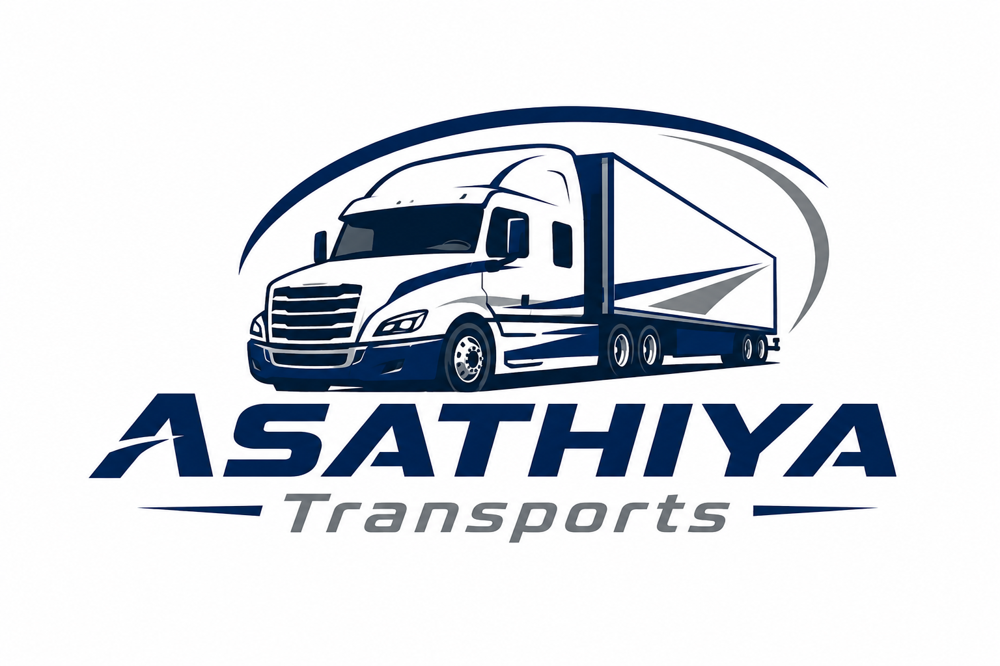
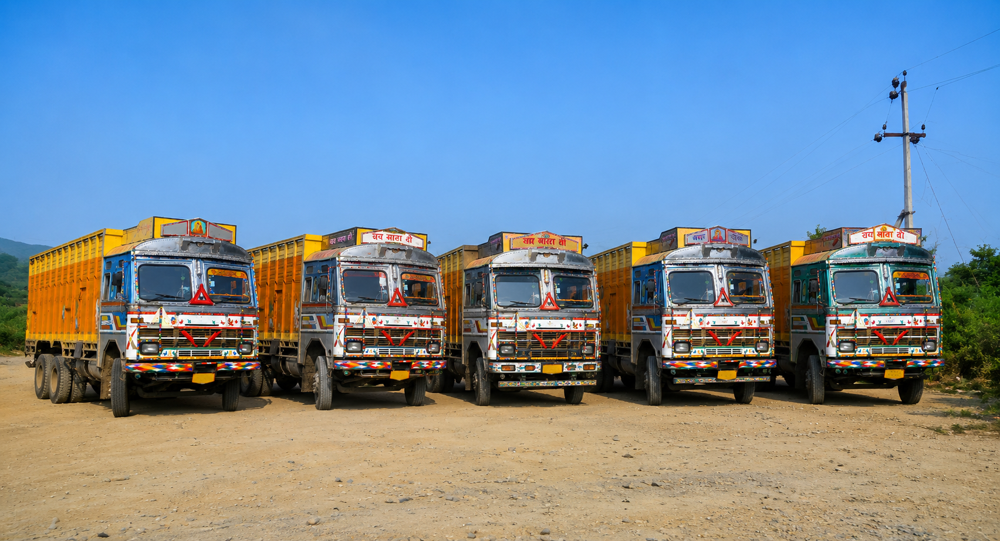
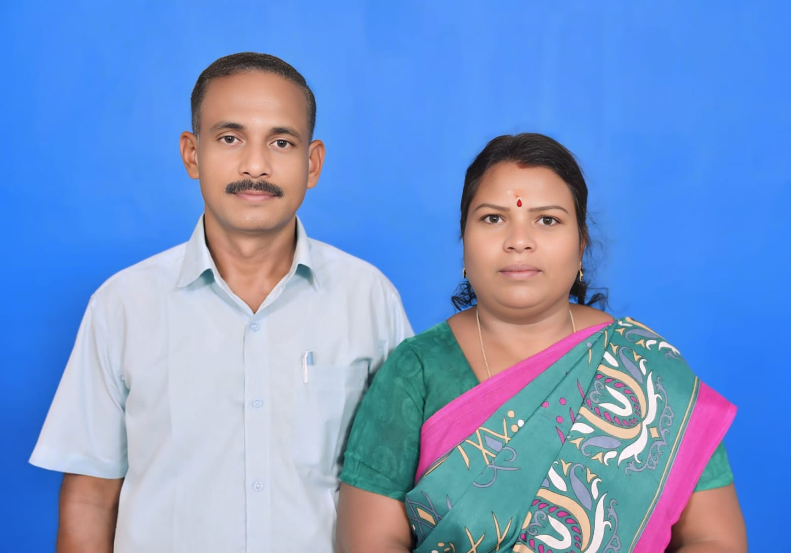
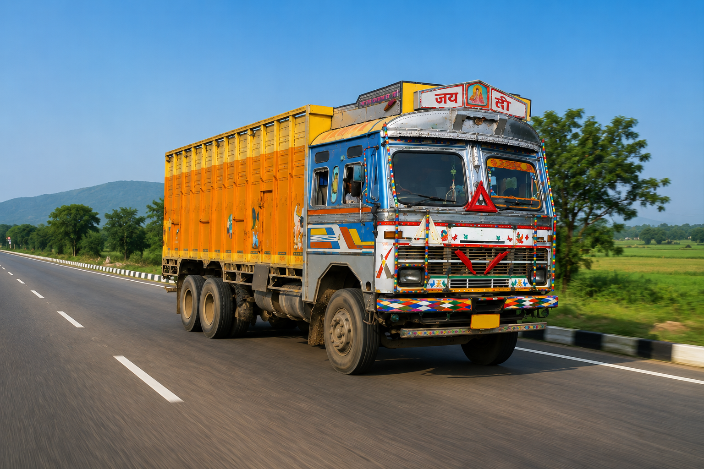
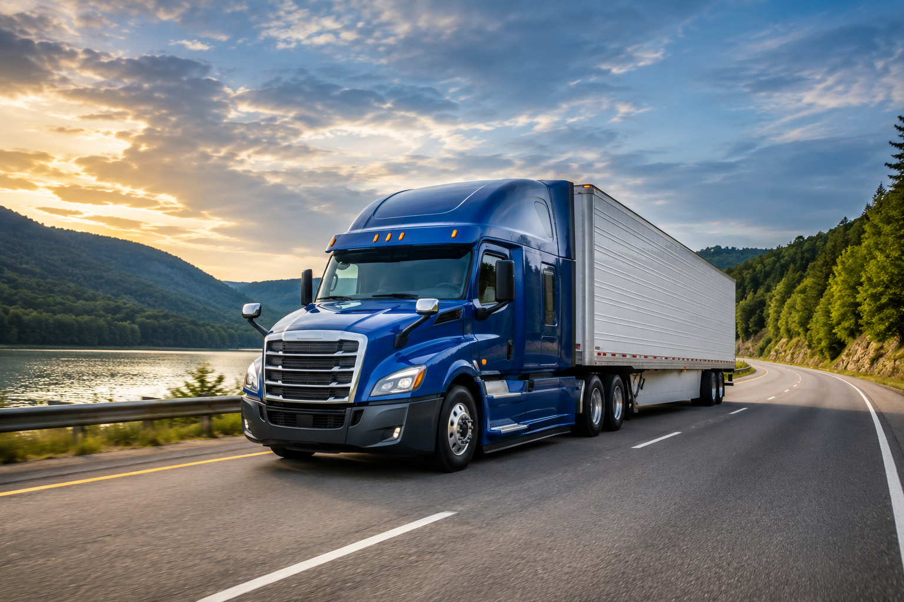

<html lang="en">

<head>
    <meta charset="UTF-8" />
    <meta name="viewport" content="width=device-width, initial-scale=1.0, maximum-scale=1.0" />
    <title>Asathiya Transports — Premium Freight Solutions</title>
    <link
        href="https://fonts.googleapis.com/css2?family=Bebas+Neue&family=Rajdhani:wght@300;400;500;600;700&family=Barlow+Condensed:ital,wght@0,200;0,300;0,600;0,700;1,200&display=swap"
        rel="stylesheet" />
    
    
    
    
</head>

<body>

    

    

    <canvas id="particles"></canvas>
    <canvas id="three-canvas"></canvas>

    <!-- LOADER -->
    

        
ASATHIYA TRANSPORTS

        

            

        

        
0%

    

    <!-- NAV -->
    <nav id="mainNav">
        

            
            ASATHIYA
        

        <ul class="nav-links">
            <li><a href="#about">About</a></li>
            <li><a href="#founder">Founder</a></li>
            <li><a href="#services">Services</a></li>
            <li><a href="#fleet">Fleet</a></li>
            <li><a href="#contact">Contact</a></li>
        </ul>
        <a href="#contact" class="nav-cta">Get Quote →</a>
    </nav>

    <!-- HERO -->
    <section class="hero" id="hero">
        

            

            

            

            

            

            

        

        

        

        

            
 Tamil Nadu's Trusted Freight Partner
            

            <h1 class="hero-title">
                ASATHIYA
                TRANS
                PORTS
            </h1>
            
Premium road freight from Tirunelveli District — delivering cargo
                across India with precision, speed, and trust.

            

                <a href="#contact" class="btn btn-fire">🚛 Get Instant Quote</a>
                <a href="#services" class="btn btn-ghost">Explore Services</a>
            

        

        

            Scroll
            

        

    </section>

    <!-- MARQUEE -->
    

        

            
Full Truck Load

            
Part Load LTL

            
Pan-India Freight

            
Express Delivery

            
Tirunelveli District

            
Tamil Nadu 627 110

            
GST Registered

            
24 / 7 Support

            
Full Truck Load

            
Part Load LTL

            
Pan-India Freight

            
Express Delivery

            
Tirunelveli District

            
Tamil Nadu 627 110

            
GST Registered

            
24 / 7 Support

        

    

    <!-- STATS -->
    

        

            

                
0

                
Years of Service

                

            

            

                
0

                
Loads Delivered

                

            

            

                
0

                
Customer Support

                

            

            

                
0

                
Coverage Area

                

            

        

    

    <!-- ABOUT -->
    <section class="about-section" id="about">
        

            
            

            
Est. Nanguneri Taluk

        

        

            
Who We Are

            <h2 class="section-h reveal">MOVING INDIA'S CARGO</h2>
            
Asathiya Transports is a GST-registered freight carrier headquartered in Anna
                Nagar, Elankulam Post, Nanguneri Taluk, Tirunelveli District. We connect businesses across Tamil Nadu
                and beyond with dependable, professional road logistics built on years of trust.

            

                

                    
Registered Address

                    
No. 184–1/3, Main Road, Anna Nagar, Elankulam Post, Nanguneri Taluk,
                        Tirunelveli Dist. TN – 627 110

                

                

                    
PAN Number

                    
AWWPV7253P
 
                    
GST IN

                    
33AWWPV7253P22A

                

            

        

    </section>

    <!-- FOUNDER -->
    <section class="founder-section" id="founder">
        

            

                

                    

                    

                        

                        

                        
                    

                

            

            

                
Leadership

                <h2 class="section-h" style="opacity: 0;">MEET OUR FOUNDER</h2>
                

                    <h3 class="founder-name">Asathiya Mani</h3>
                    
Founder & Managing Director

                

                <blockquote class="founder-quote" style="opacity: 0;">
                    "Since our inception, our mission has been simple: to deliver cargo with absolute integrity, speed, and safety. We don't just move freight; we build lasting relationships with every business we serve, ensuring that South Tamil Nadu is connected seamlessly to the rest of India."
                </blockquote>
                

                    

                        0
                        Years of Logistics Experience
                    

                

            

        

    </section>

    <!-- SERVICES -->
    <section class="services-section" id="services">
        

        

            

                
What We Do

                <h2 class="section-h reveal">OUR SERVICES</h2>
            

            
Comprehensive
                freight solutions tailored for businesses of all sizes across India.

        

        

            

                

                    

                

                

                    
01

                    
Full Truck Load

                    
End-to-end FTL transport for large consignments. Dedicated vehicle allocation
                        with direct point-to-point delivery and real-time tracking.

                    
Learn More →

                

            

            

                

                    

                

                

                    
02

                    
Part Load / LTL

                    
Cost-effective movement for smaller shipments consolidated across routes. Ideal
                        for SMEs needing flexible, economical freight solutions.

                    
Learn More →

                

            

            

                

                    

                

                

                    
03

                    
Pan-India Freight

                    
Interstate logistics covering Tamil Nadu and connecting major hubs across all
                        Indian states with reliable scheduling.

                    
Learn More →

                

            

            

                

                    

                

                

                    
04

                    
Express Delivery

                    
Time-critical shipments handled with priority routing. 24/7 support and
                        dedicated dispatch for urgent cargo requirements.

                    
Learn More →

                

            

        

    </section>

    <!-- PARALLAX BANNER -->
    

        

        

            <h2 class="reveal">ON TIME. EVERY TIME.</h2>
            
Tirunelveli · Tamil Nadu · India

        

    

    <!-- WHY US -->
    <section class="why-section" id="why">
        

            
            

            

                
100%

                
Delivery Success

            

        

        

            
Why Choose Us

            <h2 class="section-h reveal">THE ASATHIYA ADVANTAGE</h2>
            

                

                    
🛡️

                    

                        
Fully GST Registered

                        
Compliant with all Indian tax regulations. GST IN: 33AWWPV7253P22A —
                            seamless B2B invoicing for all clients.

                    

                

                

                    
📍

                    

                        
Local Expertise

                        
Deep knowledge of South Tamil Nadu routes, especially Tirunelveli,
                            Tuticorin, and surrounding districts.

                    

                

                

                    
⚡

                    

                        
Fast Dispatch

                        
Same-day booking confirmation with trucks dispatched within hours of order
                            placement.

                    

                

                

                    
📞

                    

                        
24/7 Reachability

                        
Two direct lines always open. Dedicated support for tracking updates and
                            urgent changes.

                    

                

            

        

    </section>

    <!-- FLEET -->
    <section class="fleet-section" id="fleet">
        

            
Our Fleet

            <h2 class="section-h reveal">BUILT TO DELIVER</h2>
        

        

            

                

                    

                        
Heavy Trucks

                        
20–40 Ton Capacity · FTL Specialist

                    

                

                

                    

                        
Medium Carriers

                        
8–15 Ton · Versatile Freight

                    

                

                

                    

                        
Light Commercial

                        
1–5 Ton · Express & Part Load

                    

                

                

                    

                        
Refrigerated Units

                        
Temperature Controlled · Perishables

                    

                

            

        

        

            <button class="fleet-btn" id="prevBtn">←</button>
            <button class="fleet-btn" id="nextBtn">→</button>
        

    </section>

    <!-- CONTACT -->
    <section class="contact-section" id="contact">
        

            
            

                <h2>LET'S MOVE YOUR CARGO.</h2>
                

                    

                        
📍

                        

                            
Address

                            
No. 184–1/3, Main Road, Anna Nagar, Elankulam Post, Nanguneri Taluk,
                                Tirunelveli District, Tamil Nadu – 627 110

                        

                    

                    

                        
📞

                        

                            
Mobile

                            
<a href="tel:9976731444">+91 99767 31444</a> <a
                                    href="tel:9788748900">+91 97887 48900</a>

                        

                    

                    

                        
✉️

                        

                            
Email

                            
<a href="mailto:asathiyamani1969@gmail.com"
                                    style="color:var(--red)">asathiyamani1969@gmail.com</a>

                        

                    

                

            

        

        

            
REQUEST A QUOTE

            <form id="quoteForm">
                

                    
<label>Your Name</label><input type="text" placeholder="Full name" required />
                    

                    
<label>Phone</label><input type="tel" placeholder="+91 XXXXX XXXXX" required />
                    

                

                
<label>Email</label><input type="email" placeholder="your@email.com" />

                
<label>Service Required</label>
                    <select>
                        <option value="">— Choose Service —</option>
                        <option>Full Truck Load (FTL)</option>
                        <option>Part Load / LTL</option>
                        <option>Pan-India Freight</option>
                        <option>Express Delivery</option>
                    </select>
                

                

                    
<label>From (City)</label><input type="text" placeholder="Origin" />

                    
<label>To (City)</label><input type="text" placeholder="Destination" />

                

                
<label>Message</label><textarea
                        placeholder="Cargo type, weight, special requirements…"></textarea>

                <button type="submit" class="submit-btn">Send Enquiry 🚛</button>
            </form>
        

    </section>

    <!-- GST STRIP -->
    

        

            
PAN Card No.

            
AWWPV7253P

        

        

            
GST Identification No.

            
33AWWPV7253P22A

        

        

            
State Code

            
Tamil Nadu — 33

        

        

            
District

            
Tirunelveli

        

    

    <!-- FOOTER -->
    <footer>
        

            

                

                    
                    Asathiya Transports
                

                
Premium road freight solutions from the heart of Tamil Nadu. Connecting cargo
                    to destinations across India with reliability and care.

            

            

                <h4>Navigation</h4>
                <ul>
                    <li><a href="#about">About Us</a></li>
                    <li><a href="#founder">Our Founder</a></li>
                    <li><a href="#services">Our Services</a></li>
                    <li><a href="#fleet">Our Fleet</a></li>
                    <li><a href="#contact">Contact</a></li>
                </ul>
            

            

                <h4>Contact</h4>
                <ul>
                    <li><a href="tel:9976731444">+91 99767 31444</a></li>
                    <li><a href="tel:9788748900">+91 97887 48900</a></li>
                    <li><a href="mailto:asathiyamani1969@gmail.com">asathiyamani1969@gmail.com</a></li>
                </ul>
            

        

        

            
© 2026 Asathiya Transports. All Rights Reserved. | GST: 33AWWPV7253P22A

            
Nanguneri Taluk · Tirunelveli · Tamil Nadu 627 110

        

    </footer>

    
✔ Enquiry sent! We'll contact you shortly.

    
</body>

</html>
